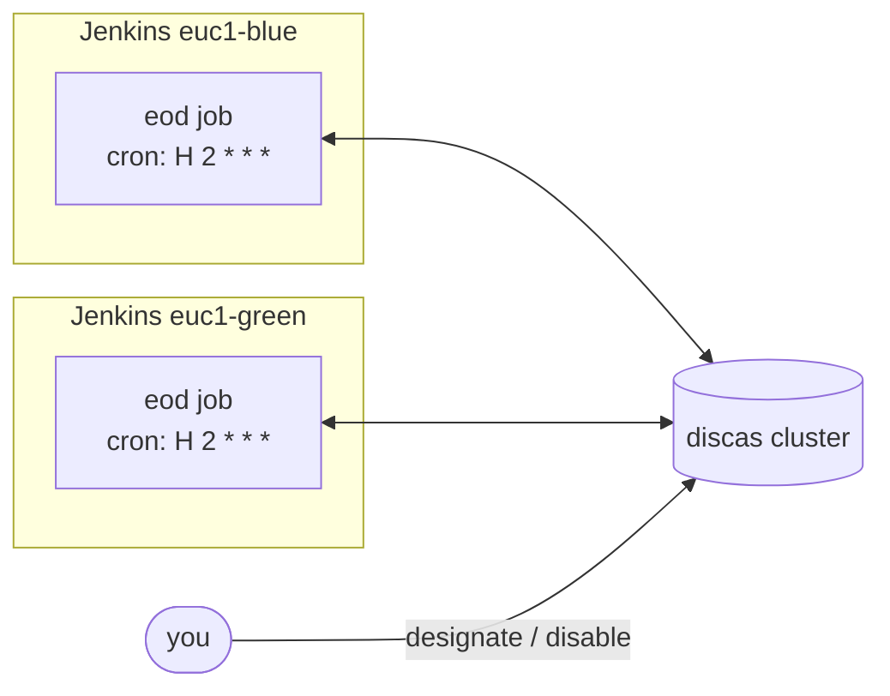
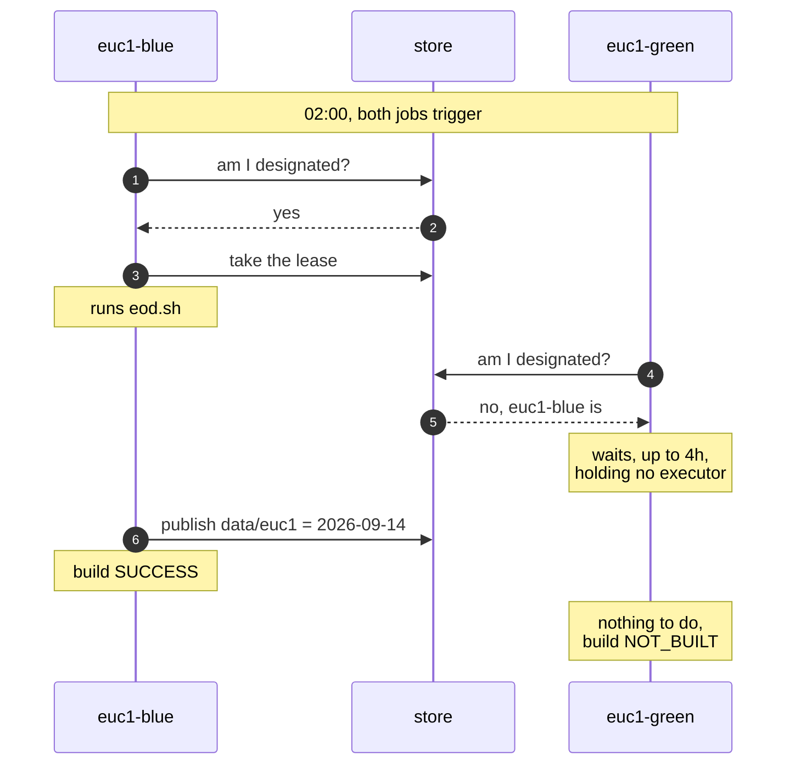

## Quick start

Two Jenkins controllers. One nightly job. Only one of them should run it, and you want to choose which
one without editing a job or redeploying anything.

That is what this page sets up, end to end. It takes about twenty minutes.

### Do you need piplex?

Answer this first. If you have **one** Jenkins controller, and no pipeline on it waits for a pipeline
somewhere else, you do not need piplex. Everything below solves a problem you do not have.

piplex is worth it when at least one of these is true:

- two or more controllers can run the same work, and exactly one of them must;
- a pipeline on one controller has to start because a pipeline on another controller finished.

### What you will build



The same job, with the same cron, on both controllers. At 02:00 both wake up. One runs the work, the
other waits quietly. You decide which one, with a single command, at any time.

You need a running [discas](https://github.com/green4j/discas) cluster (version **0.0.2 or newer**) that
both controllers can reach. Three nodes is the usual shape, and
[discas, ACLs and TLS](07-discas.md) has the commands, the ACL file and the security profiles.

This page assumes the simple profile: a cluster on a private network, in discas' default `allowall`
mode, with no token and no TLS. For a cluster that authenticates its clients, fill in the token or the
TLS stores as well -- [connecting Jenkins to it](07-discas.md#connecting-jenkins-to-it).

### Step 1. Build the plugin

```bash
./gradlew :piplex-jenkins:jpi
```

The result is:

```
piplex-jenkins/build/libs/piplex.hpi
```

There is no update centre. Install this file on **every** controller: **Manage Jenkins > Plugins >
Advanced settings > Deploy Plugin**, then restart. The minimum supported Jenkins is **2.516.3**.

### Step 2. Configure each controller

**Manage Jenkins > System > piplex**

On the first controller:

```
ownerId:  euc1-blue
clientId: piplex-euc1-blue
nodes:    n1=10.0.0.1:7101, n2=10.0.0.2:7101, n3=10.0.0.3:7101
```

On the second:

```
ownerId:  euc1-green
clientId: piplex-euc1-green
nodes:    n1=10.0.0.1:7101, n2=10.0.0.2:7101, n3=10.0.0.3:7101
```

Two rules:

- **`ownerId` must be unique.** It is how a controller is named when you hand work to it. Two
  controllers calling themselves the same thing is the one mistake piplex cannot detect for you.
- **`nodes` must be the same everywhere.** All controllers talk to one cluster. That is the only thing
  they share.

`nodes` entries are `nodeId=host:port`, separated by commas or newlines. There is no form validation
yet, so a typo shows up later as a failed build. See
[operations](06-operations.md#a-typo-in-nodes).

### Step 3. Name the first owner

Until you do this, **nobody runs the work**. A job with `designatedBy` set and no designation in the
store ends `NOT_BUILT` with:

```
piplex: did not run 'eod' because nobody is designated to run it yet
```

Open **Manage Jenkins > Script Console** on either controller and run:

```groovy
import hudson.model.TaskListener
import io.github.green4j.piplex.jenkins.PiplexConfiguration

def piplex = PiplexConfiguration.get().piplexFor(TaskListener.NULL)

piplex.designations()
      .designate('eod', 'euc1-blue', 'ops', 'initial setup')
      .toCompletableFuture()
      .join()
```

The four arguments are: what work, who runs it, who is asking, and why. The last two are written into
the record so that whoever reads the key later can see where it came from.

You only do this once. From now on the designation lives in the store and survives restarts,
reinstalls and redeploys of both controllers.

### Step 4. The Jenkinsfile

The **same** file, on **both** controllers:

```groovy
pipeline {
    agent none

    options {
        piplexExclusive(
            key: 'eod',                       // what is being competed for
            designatedBy: 'eod',              // which key names the owner
            enabledBy: 'eod',                 // which switch can turn it off
            generation: env.BUSINESS_DATE,    // which day's run this is
            completedWhen: 'data/euc1',       // skip if this day is already done
            lease: '60s',                     // how long a takeover waits, not how long the job runs
            handoverWait: '4h'                // how long the standby waits for its turn
        )
    }

    triggers {
        cron('H 2 * * *')
    }

    stages {
        stage('EOD') {
            agent any
            steps {
                sh './eod.sh'
            }
        }
    }

    post {
        success {
            piplexPublish(key: 'data/euc1', generation: env.BUSINESS_DATE)
        }
    }
}
```

Four things to notice:

**The cron goes on both controllers.** That is the point. You never comment a schedule out of one
controller's configuration again.

**`BUSINESS_DATE` is yours.** piplex does not set it. It comes from your shared library, a build
parameter, or an environment variable, and it looks like `2026-09-14`. Generations are compared as
strings, so ISO-8601 dates are safe and a bare counter must be zero-padded (`09`, not `9`).

**`key` names a resource, not a job.** `eod` is what the two pipelines compete for. If you later rename
the job, or split it in two, the key stays right.

**`piplexPublish` goes in `post { success { } }` and nowhere else.** A milestone says the data is there.
A job that publishes on the way out regardless of outcome tells everyone downstream that half-written
data is ready.

### What happens at 02:00

Say `euc1-blue` is designated.



The standby build does not fail, and it does not occupy an executor, an agent or a thread while it
waits. It ends `NOT_BUILT` with the reason on the build page:

```
piplex: did not run 'eod' because 'euc1-blue' is designated to run it
```

That matters more than it sounds. Three controllers a night going red for doing exactly what they were
told is not a signal anybody keeps reading.

### Switching controllers

One command, from the Script Console:

```groovy
piplex.designations()
      .designate('eod', 'euc1-green', 'ops', 'INC-4821')
      .toCompletableFuture()
      .join()
```

`euc1-green` is the owner from this moment on. What happens next depends on what is going on at the
time:

| When you switch | What happens |
|---|---|
| nothing is running | the next run on `euc1-green` picks the work up |
| `euc1-blue` is running it | that run is **stopped** (`ABORTED`), its lease released |
| `euc1-green` is parked on `handoverWait` | it wakes up, sees its own name, and takes over within seconds |

Designating the controller that is already named does nothing at all. Running your switchover job twice
is harmless.

### Turning the work off

To stop the work everywhere, including a run already in flight:

```groovy
piplex.switches()
      .disable('eod', 'INC-4821')
      .toCompletableFuture()
      .join()
```

The running build is `ABORTED` and prints your reason. Every later build ends `NOT_BUILT`. Nobody takes
over: that is the difference between turning something off and handing it to somebody else.

Back on:

```groovy
piplex.switches()
      .enable('eod')
      .toCompletableFuture()
      .join()
```

Write a reason people can act on. A ticket, an incident, a name. It is printed in the log of every build
it stops, and it is what somebody reads at 03:00.

### Waiting for the data, from another pipeline

Any other pipeline, on any controller, can wait for what the EOD job produced:

```groovy
stage('Wait for EOD data') {
    steps {
        piplexAwait(
            key: 'data/euc1',
            generation: env.BUSINESS_DATE,
            timeout: '90m'
        )
    }
}
```

The build continues as soon as `data/euc1` reaches that date. Not before, and no fixed sleep guessing
how long the producer takes.

The producer does not know who is waiting, and the waiter does not know who produces. Adding a second
consumer changes nobody's configuration but its own.

If the data does not arrive in 90 minutes, the build **fails**. That is the right default: something
that was supposed to arrive did not. Pass `skipOnTimeout: true` if ending `NOT_BUILT` is genuinely the
better answer for that job.

### Before you go live

Five things worth knowing now rather than at 03:00.

**`lease: '60s'` is not how long your job may run.** The lease is renewed automatically for as long as
the work lasts. What it bounds is how long a takeover waits when a controller dies without releasing it.
Setting it to `4h` because the job takes four hours is the most common way to make handovers slow.

**Stopping a run does not undo what it already did.** piplex aborts the build. Files it wrote, rows it
inserted and messages it sent are still there.

**Brief overlap is possible.** piplex guarantees that at most one controller *considers itself* the
owner. Between a lease lapsing and its former holder noticing, both may believe they hold it. Every
admitted run carries a `fencingToken`, but that only helps if the resource you are protecting rejects a
stale one, and most do not.

**So make the work idempotent.** Running `eod.sh` twice for the same business date should be safe. This
is a property of your work, not something piplex can add to it.

**A nightly job should not poll every second.** A standby controller parked on `handoverWait` polls
the cluster for a designation it is waiting for, and out of the box that is once a second for four
hours. Set **Watch poll period** to `30s` in **Manage Jenkins > System > piplex** and the standing
cost drops about twentyfold, at the price of noticing a switchover up to 30 seconds later. See
[cost of watching](06-operations.md#cost-of-watching).

**Change settings when nothing is running.** Editing `ownerId`, `clientId` or `nodes` closes the store,
and a run in flight is stopped shortly after.

### Where to go next

You now have a working two-controller setup. The rest of the documentation explains what is underneath
it:

- [2. Exclusive run](02-exclusive-run.md) -- every parameter of `piplexExclusive`, what each outcome
  means, and how a handover works step by step.
- [3. Milestones](03-milestones.md) -- publishing and waiting, and how to choose keys and generations.
- [4. Switches](04-switches.md) -- turning work off, and draining one controller.
- [5. The Jenkins plugin](05-jenkins.md) -- the three steps in full, and what a controller restart does.
- [6. Operating piplex](06-operations.md) -- the procedures, and what to look at when something is wrong.
- [7. discas, ACLs and TLS](07-discas.md) -- the cluster itself, per-client ACLs, and mTLS across
  regions.
- [1. The model](01-model.md) -- the store, the four keys, and why everything compares state. Read this
  when you want to know *why* it behaves the way it does.

---

Next: [1. The model](01-model.md)
