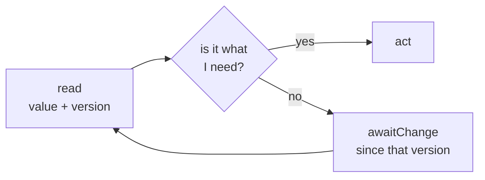
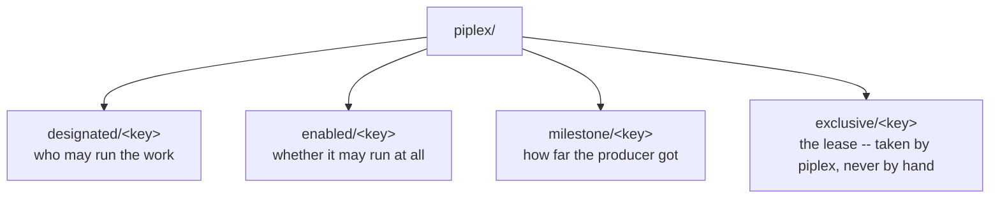
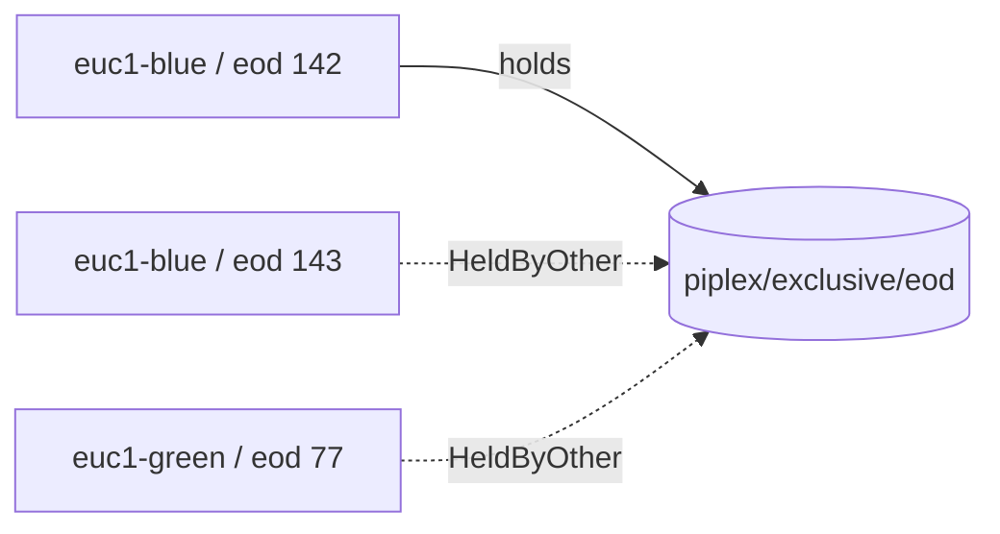
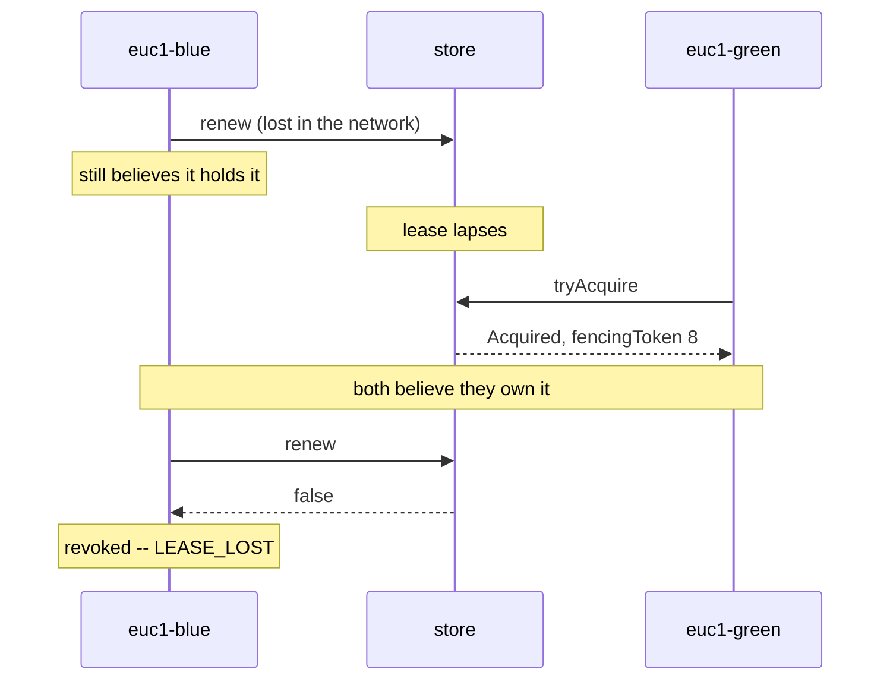

## 1. The model

Everything in piplex is built on three things: one small interface, four keys, and one rule about how
they are read. Understand these and the rest follows.

### The store

`CoordinationStore` ([source](../piplex-core/src/main/java/io/github/green4j/piplex/store/CoordinationStore.java))
is six operations plus a `close()`. Any store that has them can run piplex. A store with a pub/sub topic
and no compare-and-set cannot.

| Operation | Answers |
|---|---|
| `get(key)` | the value **and the version it was read at** |
| `compareAndSet(key, expectedVersion, value)` | `true` if it landed, `false` if the version had moved |
| `awaitChange(key, sinceVersion, maxWait)` | "something moved, look again", bounded by `maxWait` |
| `tryAcquire(key, ownerId, ttl)` | acquired / held by self / held by somebody else |
| `renew(key, handle, ttl)` | `true` still yours, `false` not any more |
| `release(key, handle)` | gives it back |
| `close()` | ends the store; outstanding waiters are failed, not left hanging |

Two properties of this interface shape everything above it.

**Every read returns a version.** This is what makes a write conditional and a wait answerable. You can
only ask "has this moved since I looked" if you kept what you looked at.

**A watch is not a subscription.** `awaitChange` tells you the value left the version you gave it. It
does not tell you how many times it changed, or through which values. If a value went A to B and back to
A while nobody was watching, a watcher learns nothing. That is correct behaviour, not a lost event.

### The rule: compare state, never count events

Every primitive follows the same loop.



This is not a style choice. It falls out of the store coalescing changes: a waiter that counted events
would miss the one it needed.

Three things follow, and all three matter:

- **Restarts are free.** Nobody holds a position in a stream, so there is nothing to lose. A waiter that
  comes back after a controller restart reads the key and carries on.
- **Retries are free.** Asking again is the same call as asking.
- **Intermediate states are never acted on.** If a designation flipped away and back while a watch was
  in flight, the answer that comes back is the current one: still mine. Reacting to the intermediate
  state would have been the mistake.

### The four keys

An operator reads and edits three of these by hand, so the layout is part of the contract.



| Key | Written by | Value |
|---|---|---|
| `piplex/designated/<key>` | an operator, out of band | `{"owner":"euc1-blue","by":"ops","reason":"INC-4821","at":"...","prev":"euc1-green","seq":4}` |
| `piplex/enabled/<key>` | an operator | `{"enabled":false,"reason":"INC-4821"}` |
| `piplex/milestone/<key>` | a producer, on success | `{"generation":"2026-09-12","by":"euc1-blue","runId":"eod #142","at":"..."}` |
| `piplex/exclusive/<key>` | piplex | a lease, taken under `ownerId/runId` |

The first three hold JSON. Two reasons: a coordination key is read by people at three in the morning as
often as by code, and the store underneath carries bytes and has no opinion about them.

The fourth is different. A lease is a lock in the store's own terms, and over discas that is a binary
lock record written by `tryAcquire`. It is neither readable nor writable by hand. To find out who holds
it, ask piplex: the answer comes back on the build that was turned away.

piplex acts on exactly one field of each record: `owner`, `enabled`, `generation`. The rest is
provenance, so that somebody reading the key can see who put it there and when without opening another
system. **None of it is an audit trail.** It is written by the same client it describes, and a wrong or
malicious writer can put anything in it. Audit belongs at the operation, not in the value.

### Generations

A `Generation` is an opaque string, usually a business date, **compared lexicographically**. That is
enough for the shapes worth using, and it avoids inventing an ordering nobody asked for. It does put one
burden on the caller:

```
"2026-09-11" < "2026-09-12"     safe: ISO-8601 orders the way time does
"10" < "9"                      a bare counter must be zero-padded
```

`Generation.ofDate(LocalDate)` is safe by construction. A test pins the `"10" < "9"` behaviour on
purpose, so that nobody "fixes" it into natural ordering and quietly changes what every comparison in
every pipeline means.

### Identity

There are two identities here, and confusing them is the mistake worth naming.

**`ownerId` is the deployment.** `euc1-blue`. Not a worker, not a build. It is what a designation names,
what every log line carries, and what a second controller must not also call itself.

It is not derived from anything. A Jenkins URL can change; a hostname is a detail of where the thing
happens to run. Either one changing silently would hand the work to the wrong region. So it is typed in
by hand, once, per controller.

**A lease is held by a run, not by a deployment.** The lease owner is `ownerId + "/" + runId`:



A store may answer "you already hold this" when the owner matches. That answer is only safe if the owner
names one holder. With the deployment alone, two concurrent runs on the same controller would both be
let in, which is exactly what the lease exists to prevent. With the run included, a second run sees a
lease held by somebody else, while a retry of the same run after an unknown outcome still recognises its
own.

### Time

`TimeSource` is one argument, not two. Inside it, the two readings are kept apart.

| Reading | Used for |
|---|---|
| monotonic (`nanos`) | every duration: leases, renewals, deadlines, how long a parked run waits |
| wall clock (`wallTime`) | one thing only -- the timestamp written into a record for a person to read |

A wall clock is allowed to step. A lease timed against one can lapse early, and an early lapse means two
owners at once. So nothing piplex decides is allowed to notice an NTP correction. The test harness has a
`jump()` that moves the wall clock alone, precisely to prove that.

### What piplex guarantees, and what it does not

It guarantees that **at most one controller considers itself the owner**.

It does not guarantee that at most one controller can still *affect* a protected resource. Between a
lease expiring and its former holder noticing, both may believe they hold it:



The `fencingToken` carried by an admitted run is what closes that window. It only closes it if the
**protected resource itself** rejects a stale token, and most resources do not. Where it cannot, the
overlap is real. Stopping a run half way is not the same as making half-finished work harmless, and that
part is a property of your work, not of piplex.

Milestones compose well with this. A milestone is published only on success, so an interrupted producer
publishes nothing and consumers keep waiting rather than proceeding on a partial result.

---

Previous: [0. Quick start](00-quick-start.md) &middot; Next: [2. Exclusive run](02-exclusive-run.md)
