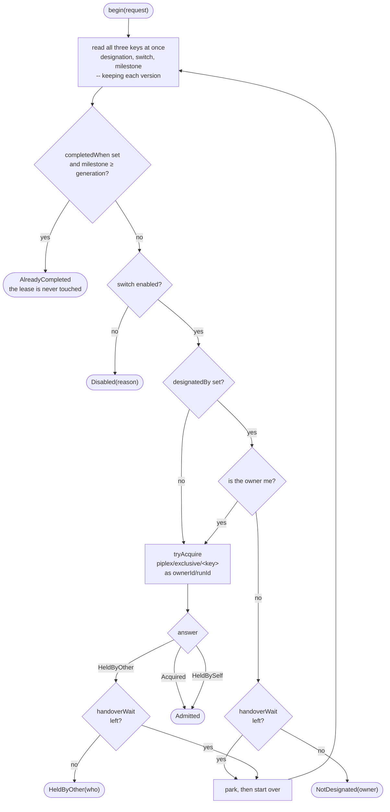
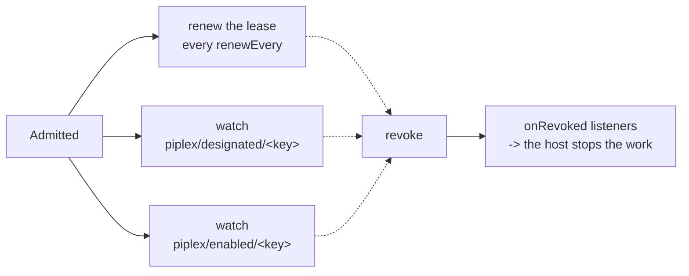
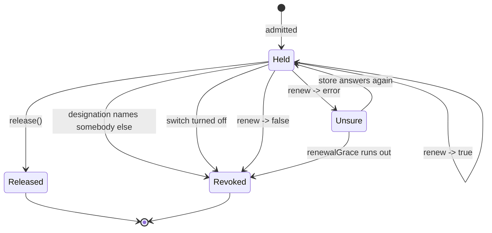
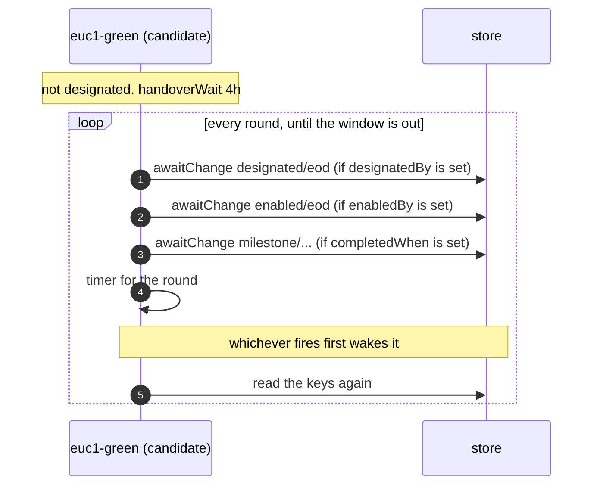
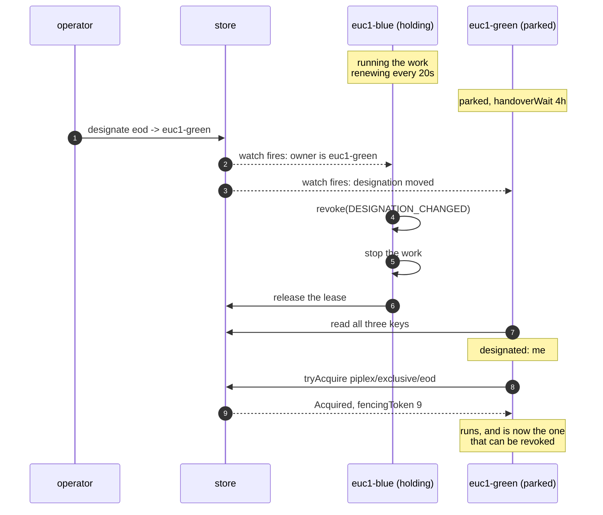

## 2. Exclusive run

Who is allowed to run the work. And, the part that matters, keeping that answer true for as long as the
run lasts.

Source: [`ExclusiveRuns`](../piplex-core/src/main/java/io/github/green4j/piplex/exclusive/ExclusiveRuns.java),
[`HeldAdmission`](../piplex-core/src/main/java/io/github/green4j/piplex/exclusive/HeldAdmission.java),
[`Designations`](../piplex-core/src/main/java/io/github/green4j/piplex/exclusive/Designations.java).

### Two policies, one call

These are different guarantees, not settings.

| | Elected | Designated |
|---|---|---|
| Set by | `designatedBy` unset | `designatedBy` names a key |
| Who runs | whoever takes the lease | whoever the key names |
| Right when | the controllers are interchangeable | they are not |
| The lease guards | the whole decision | two concurrent runs **by the designated owner itself** |

"The current primary region" is a fact somebody decides. Whoever happened to wake up first is the wrong
answer to it. That is the whole case for the designated policy.

### Asking: `begin(request)`

The order of the checks is fixed, and each step is cheaper than the one after it.



Three details in that picture are deliberate.

**All three keys are read together**, with their versions kept
([`readGuards`](../piplex-core/src/main/java/io/github/green4j/piplex/exclusive/ExclusiveRuns.java#L143)).
Not to save a round trip. A park waits for one of these keys to *move*, and it can only ask that
question against the version it saw.

**`HeldBySelf` is a success, not contention.** It is what an acquire whose outcome was never learnt looks
like on retry: the write landed, the answer did not come back. Treating it as contention would turn every
flaky network into a build that refuses to run.

**The milestone check comes before the lease.** Work already done for this generation should not have to
take a lease to find that out.

### The five outcomes

Everything but `Admitted` means "do not run". They are kept apart because they mean different things to
whoever reads the log. Three of them are normal; one is contention.

| Outcome | Meaning |
|---|---|
| `Admitted` | you own it, and will be told when you stop owning it |
| `NotDesignated(currentOwner)` | somebody else is named. Normal on every controller but one |
| `HeldByOther(heldBy)` | a run is under way. `heldBy` is `ownerId/runId`, because "another run on this very controller" is a different problem from "another controller has it" |
| `AlreadyCompleted(reached)` | nothing to do for this generation |
| `Disabled(reason)` | switched off |

### Ownership is held, not granted

`Admitted` is live. Three things run behind it for as long as the run does:



The lifecycle:



`Unsure` is the state worth staring at. It is neither a failure nor normal operation:

| `renew` answers | Means | piplex does |
|---|---|---|
| `true` | still yours | carry on |
| `false` | **not yours any more** -- lapsed, or taken | revoke at once, `LEASE_LOST` |
| an error | **unknown** -- the store cannot be reached | tolerate for `renewalGrace`, then revoke with `RENEWAL_FAILED` |

The difference between the last two rows is the whole design in one line. **A refusal is evidence. An
error is the absence of evidence.** The lease cannot be extended, and it also cannot be learnt whether
anybody else has taken it. So the run is tolerated for a bounded window and then given up: acting as the
owner on no evidence is the worse of the two mistakes.

A **watch** that fails says nothing at all, and is simply re-armed. Whether unreachability has gone on
long enough to matter is the renewal loop's decision, and it is made in exactly one place.

| `Revocation.Reason` | Cause |
|---|---|
| `DESIGNATION_CHANGED` | an operator named somebody else. Planned, and the usual case |
| `DISABLED` | the work was switched off underneath the run |
| `LEASE_LOST` | the lease lapsed or was taken while this run still believed it held it |
| `RENEWAL_FAILED` | the store could not be reached for longer than `renewalGrace` |
| `GUARD_UNREADABLE` | the watched designation or switch no longer parses -- almost always a hand edit |

A guard that stops parsing ends the run, with no grace period: the same bytes read again say the
same thing. The build log names the key to fix.

### Parking: why a candidate does not just leave

A controller that is not designated **waits** rather than exiting, for up to `handoverWait`. If it
exited, there would be nobody left to take over, and on a daily schedule the next chance is tomorrow.

A park is a loop of short rounds, not one long wait:



**Each wait is bounded by this round, never by the whole window.** That is the point. A watch outliving
its round would be joined next round by another, and another, until an hour of waiting means hundreds of
outstanding requests against the same three keys, each still entitled to report what it found. Bounded,
a round leaves nothing behind it. A test pins exactly this: a second hour of parking must cost what the
first one did, and the timers outstanding must be a handful, not one per round.

Only the keys the request actually named are watched. A request with no `enabledBy` raises no watch on a
switch.

Four things can end a round, and each is a different answer to "is it my turn yet":

| Waking on | Because |
|---|---|
| the designation moved | it may name me now |
| the switch moved | there may be nothing to wait for |
| the milestone moved | somebody else finished it -- stop waiting entirely |
| the timer | **the only way a freed lease gets noticed** -- a lease is not a key anybody can watch |

How long a round lasts
([`untilNextLook`](../piplex-core/src/main/java/io/github/green4j/piplex/exclusive/ExclusiveRuns.java#L306)):
normally `renewEvery`. But if the store said how much of the holder's lease is left and that is longer,
wait for the lease instead, because until it lapses nothing this candidate could read would change the
answer. Never longer than what remains of the handover window.

### A handover, end to end

The usual operational event, in full. Blue holds, green is parked, an operator moves the designation.



If blue has not released yet when green looks, green gets `HeldByOther` and parks for one more round,
bounded by what is left of blue's lease. Nothing is lost. The handover simply takes as long as the lease
does.

**That is what the lease duration buys.** It is why the lease is short (60s by default) and why it has
nothing to do with how long the work runs.

### The request

| Field | Default | What it is |
|---|---|---|
| `key` | required | what is being competed for. A **resource**, not a pipeline name, so two pipelines touching the same thing name the same key |
| `ownerId` | required | this deployment |
| `runId` | required | this run |
| `designatedBy` | `null` | the key naming the owner; unset means elect |
| `generation` | `null` | which round of work this is |
| `completedWhen` | `null` | the milestone whose reaching this generation means there is nothing to do |
| `enabledBy` | `null` | the switch to consult, and to be stopped by |
| `lease` | 60s | how long the lease lasts unless renewed. The handover bound |
| `renewEvery` | `lease / 3` | how often to renew |
| `renewalGrace` | `lease` | how long an unreachable store is tolerated |
| `handoverWait` | 0 | how long to park rather than give up |

Renewal and grace follow the lease unless you ask for something else. Shortening the lease for a faster
handover therefore cannot silently leave renewals too far apart to keep it.

### The operator's side: `Designations`

```java
designations.designate("eod", "euc1-green", "ops", "INC-4821");
```

Read-modify-CAS on `piplex/designated/<key>`, up to 8 attempts, then `ContendedException`.

Designating the owner who is already named is **idempotent**: `changed = false`, nothing is rewritten,
and `seq` does not move. Re-running the operator's job is harmless.

The record that comes back carries `prev` and a `seq` bumped by one. That is what lets a person
comparing two observations tell whether they are looking at the same change.

Nothing in piplex reconstructs the sequence of changes from `seq`. Everything that waits on this key
compares the state it finds.

---

Previous: [1. The model](01-model.md) &middot; Next: [3. Milestones](03-milestones.md)
