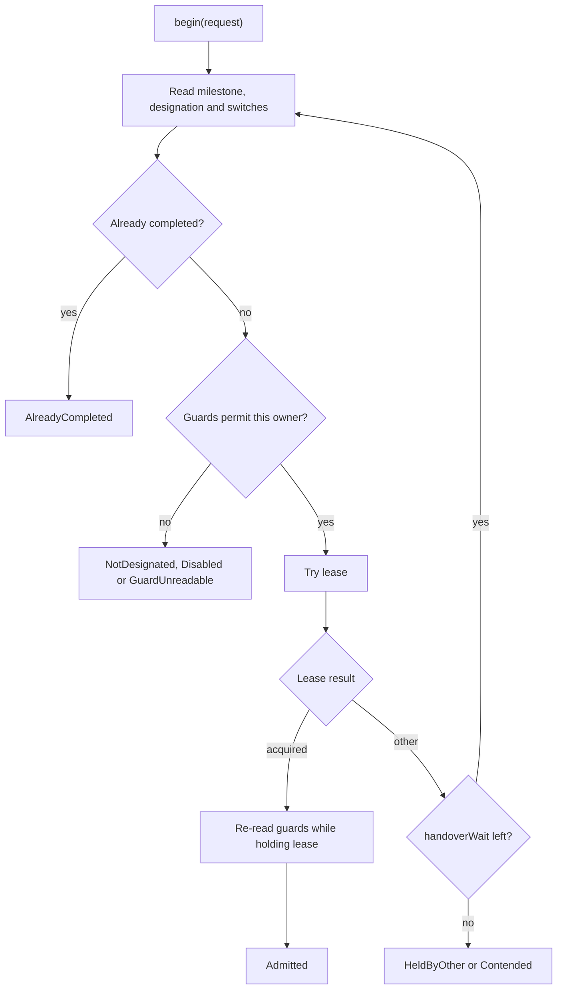

## 2. Exclusive runs

`ExclusiveRuns.begin(request)` decides whether one run may proceed and keeps that decision current
for the life of the work.

### Election and designation

- **Elected:** leave `designatedBy` unset. Any candidate may take the lease.
- **Designated:** set `designatedBy`. Only the owner named by that designation may take the lease.

Designation answers who should run; the lease prevents two runs by that owner from entering together.



The second guard read prevents starting from a designation, switch or milestone value that changed
while the lease was being acquired.

### Admission outcomes

| Outcome | Meaning |
|---|---|
| `Admitted` | The run currently holds the lease and guards |
| `NotDesignated` | Another owner, or nobody, is designated |
| `HeldByOther` | Another execution holds the lease |
| `Contended` | Nobody is known to hold it, but this acquire lost a write race |
| `AlreadyCompleted` | `completedWhen` has reached the requested generation |
| `Disabled` | The shared or per-owner switch is off |
| `GuardUnreadable` | A designation, switch or milestone record cannot be parsed |

Only `Admitted` permits work.

### Held ownership

An `Admitted` handle renews the lease and watches every designation or switch that admitted the run.
Register `onRevoked` before starting work. On revocation:

1. renewals stop;
2. listeners are told to stop the work;
3. the host calls `release()` after the work has actually stopped.

The lease remains until release succeeds or its term lapses. Releasing immediately from the watch
would allow a replacement to start while the old work was still stopping.

Revocation reasons distinguish operational changes from faults:

| Reason | Meaning |
|---|---|
| `DESIGNATION_CHANGED` | Another owner, or nobody, is now designated |
| `DISABLED` | A switch was turned off |
| `LEASE_LOST` | The store answered that the lease no longer belongs to this run |
| `RENEWAL_FAILED` | A renewal outcome could not be learned before the safe deadline |
| `GUARD_UNREADABLE` | A watched guard no longer parses |
| `GUARD_UNREACHABLE` | A guard could not be confirmed for `guardGrace` |

`renewalGrace` and `guardGrace` are separate because lease calls and guard reads can fail
independently. Neither extends ownership past the current lease term. See
[the safety boundary](01-model.md#guarantees).

### Parking and handover

A candidate that is not designated, or finds the lease occupied, may wait for `handoverWait`.
Parking holds no thread or executor. Each bounded round watches:

- `piplex/designated/<designatedBy>`;
- `piplex/enabled/<enabledBy>`;
- `piplex/enabled/<enabledBy>/@<ownerId>`;
- `piplex/milestone/<completedWhen>`;
- plus a timer, because the lease itself has no watch.

Only configured keys are watched. Every round then reads all guards again. After a guard changes,
lease checks briefly accelerate from 500 ms and back off to the normal renewal interval.

During a handover, the old holder is revoked, stops and releases; the parked new owner wakes and
acquires. If the old process disappears, takeover waits at most for its lease to lapse.

### Request fields

| Field | Default | Meaning |
|---|---|---|
| `key` | required | Resource being protected |
| `ownerId` | required | Deployment asking to run |
| `runId` | required | Run asking to enter |
| `executionId` | `null` | Distinguishes concurrent asks by one run; must survive restart |
| `designatedBy` | `null` | Designation key; unset elects |
| `generation` | `null` | Work generation |
| `completedWhen` | `null` | Milestone that makes this generation unnecessary |
| `enabledBy` | `null` | Shared switch; also enables the per-owner switch |
| `lease` | 60 s | Lease term and worst-case handover bound |
| `renewEvery` | `lease / 3` | Normal renewal interval |
| `renewalGrace` | `lease` | Maximum silence tolerated from lease operations |
| `guardGrace` | `renewalGrace` | Maximum time a guard may remain unconfirmed |
| `handoverWait` | zero | How long a non-running candidate parks |

`renewEvery` must be positive and shorter than `lease`. Grace periods must be positive;
`handoverWait` may be zero.

The lease identity is `ownerId/runId[/executionId]`. A retry after an unknown acquire outcome must use
the same identity; genuinely concurrent asks must use distinct `executionId` values.

### Completion ordering

When `completedWhen` is set, publish the requested generation before releasing the lease. Otherwise a
new candidate can be admitted between release and publish and repeat completed work.

```java
PublishResult result = admitted.completeAndRelease().toCompletableFuture().join();
```

The method publishes only while ownership is still locally held, then releases whatever the publish
outcome. A write already sent cannot be recalled if revocation races with it.

### Designations

Operators change designated ownership with a version-fenced write:

```java
designations.designate("eod-owner", "euc1-green", "INC-4821");
```

Designating the current owner is a no-op. Concurrent writers retry up to eight compare-and-set
attempts, then fail with `ContendedException`. Records retain the current owner and human-readable
provenance; they are not an audit log.

Previous: [1. Model](01-model.md) · Next: [3. Milestones](03-milestones.md) · [Documentation index](README.md)
