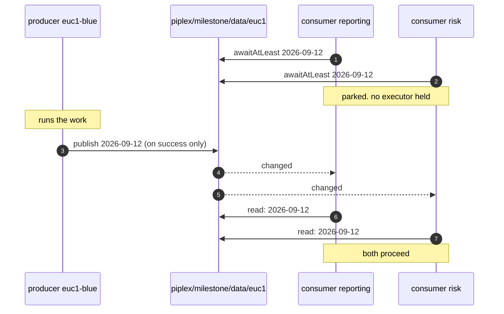
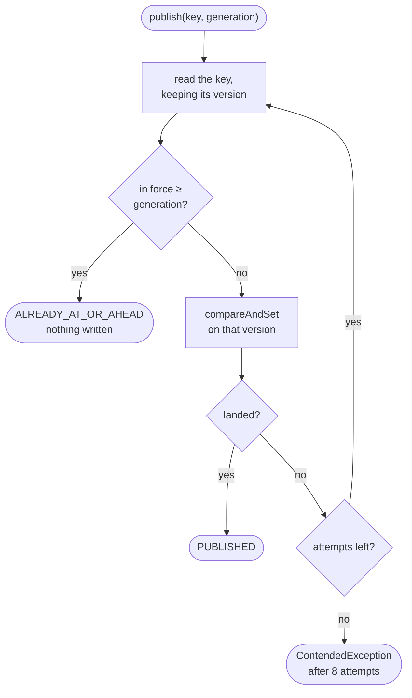
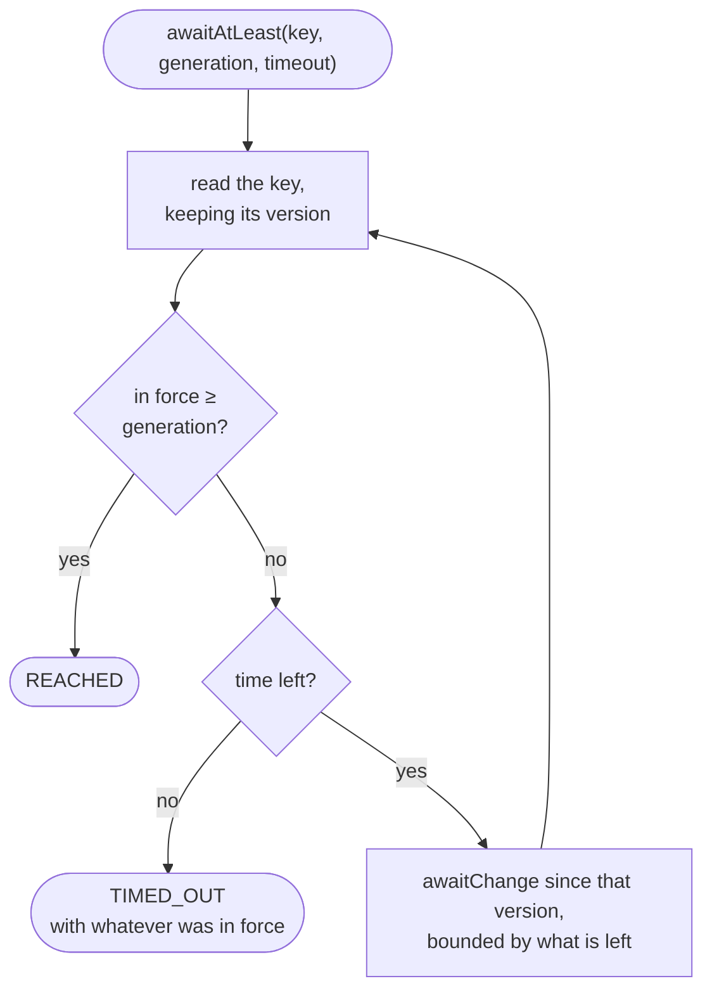

## 3. Milestones

Two questions: how far did the producer get, and how do I wait until it got far enough.

This is what makes a pipeline on one controller start because a pipeline on another finished. Neither
knows the other exists, and no schedule has to guess how long the first one takes.

Source: [`Milestones`](../piplex-core/src/main/java/io/github/green4j/piplex/milestone/Milestones.java).

### The picture



The producer does not know who is waiting. The consumers do not know who produces. Adding a third
consumer touches nobody's configuration but its own.

### Publishing is monotonic and idempotent



Two consequences, and both are why the Jenkins step can simply be re-run:

- re-running a producer for an **earlier** generation is a no-op, not a regression. A milestone never
  moves backwards.
- re-running it for the **same** generation costs one read.

**Publish on success and only on success.** A producer stopped half way must leave the milestone where
it was, so that waiters keep waiting rather than proceed on a partial result. A producer that publishes
on the way out regardless of outcome turns every waiting pipeline into a consumer of half-written days.

### Waiting compares state



The waiter holds **no position of its own**. It knows which generation it needs, and it reads the key.
A controller that restarts mid-wait simply looks again.

This is also why nothing anywhere has to remember "the last generation I acted on": the waiter brings
that with it. That single fact is the reason no consumer-side state exists in piplex at all.

`TIMED_OUT` comes back with what *was* in force, so the caller can say "waited for 2026-09-12, it is at
2026-09-11" rather than only that the wait ended.

### The record

```json
{
  "generation": "2026-09-12",
  "by": "euc1-blue",
  "runId": "eod #142",
  "at": "2026-09-12T03:14:07Z"
}
```

Only `generation` means anything to piplex. The rest is there so that somebody reading the key can see
who put it there and when without opening another system.

`at` comes from the wall clock, which piplex uses for the timestamp in a record and for nothing else.
It is for a person to read, never for a decision.

### Choosing a key and a generation

**The key names data, not a job**: `data/euc1`, `positions/eod`, `fx-rates/apac`. A consumer waits for
the data it needs, and stays right when the job that produces it is renamed, split in two, or moved to
another controller.

**The generation is usually the business date.** It is compared lexicographically, so ISO-8601 is safe
and a bare counter must be zero-padded. See [the model](01-model.md#generations).

**One milestone per thing.** Where a producer emits several things at different times, give each its own
milestone rather than one milestone with a compound generation. `awaitAtLeast` compares one string, and
two facts in one string means neither can be waited for on its own.

---

Previous: [2. Exclusive run](02-exclusive-run.md) &middot; Next: [4. Switches](04-switches.md)
