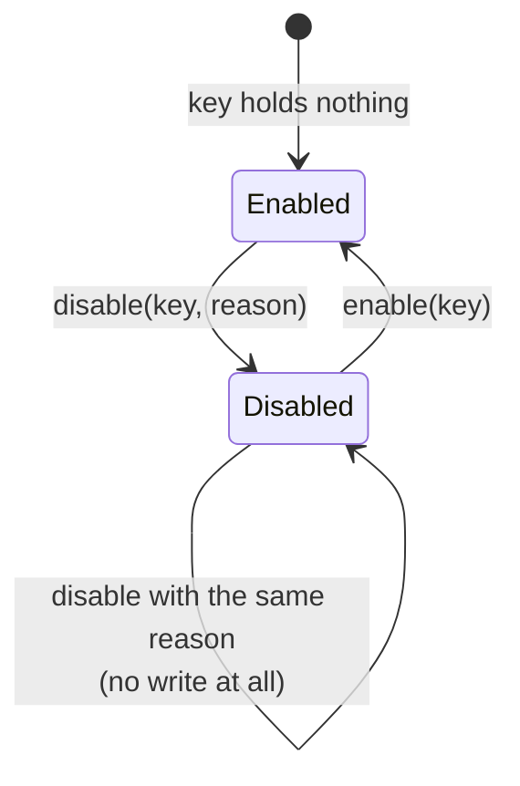
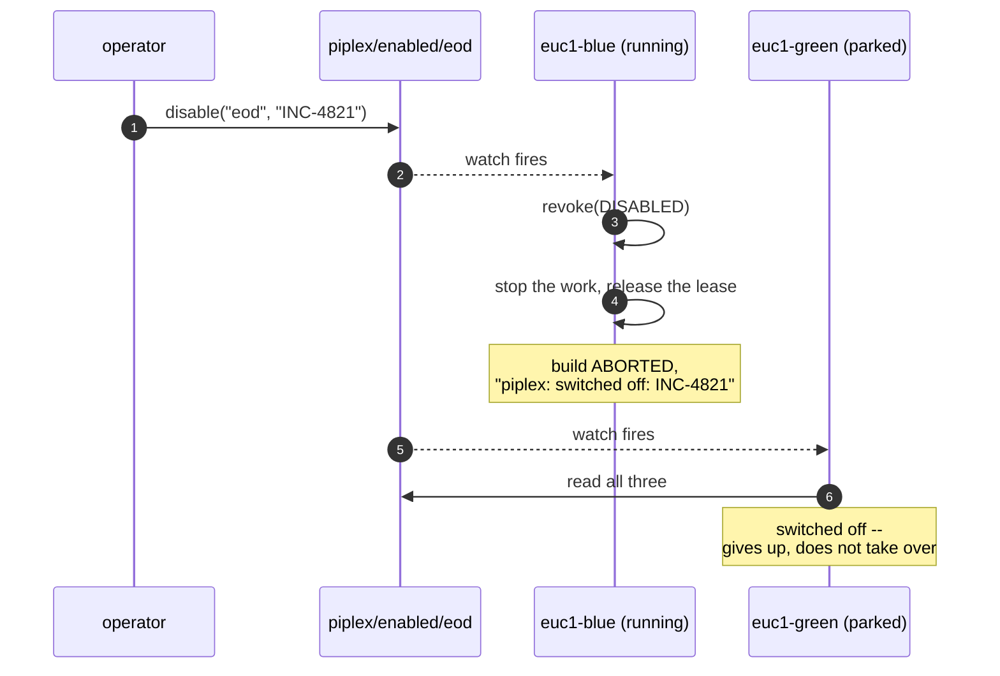

## 4. Switches

Turning work off, everywhere, in a second. Including what is already running.

Source: [`Switches`](../piplex-core/src/main/java/io/github/green4j/piplex/switches/Switches.java).

This replaces the commonest piece of orchestration folklore there is: commenting a schedule out of one
deployment's configuration and redeploying it by hand.

One write does the same thing, everywhere, at once. And unlike the redeploy, it also stops a run already
in flight, through the same machinery that stops one whose owner changed.

### An absent key means on



**Switching off is always the deliberate act.** A store that has never been written to, or one whose key
somebody deleted, does not silently stop the work. This is a guarantee, not an accident of the
implementation, and a test pins it.

`disable` with what is already in force short-circuits before the write. An operator's job that runs
twice does not churn the key or wake every watcher a second time.

### What it does to a run in flight



Note the second half. **A drain does not hand the work to the next controller.** Everybody who looks
sees the same `false`.

This only reaches a run that asked for it. `enabledBy` has to be set on the request, or the switch is a
value nobody consults.

### The record

```json
{"enabled": false, "reason": "INC-4821"}
```

The reason is what the stopped runs print in their logs. Write the thing whoever finds the red build at
03:00 needs: a ticket, an incident, a name.

The record carries the reason and **nothing else**. Who flipped it and when belong to the door the write
went through -- the log of the job that made it -- not to a value the same client could write anything
into.

### Draining one controller

A key of the form `<work>/<owner>` is an ordinary key, and is how one deployment alone is taken out:

```
piplex/enabled/eod              the work, everywhere
piplex/enabled/eod/euc1-blue    the work, on one controller
```

Nothing in piplex knows about the second shape. The naming convention is the whole mechanism, and
`Switches` reads it like any other key.

**From a pipeline this is awkward today, and worth saying plainly.** `piplexExclusive` takes exactly one
`enabledBy`, and no step reads a switch on its own, so a job cannot consult both the global switch and a
per-controller one.

What works is putting the controller into the key the job already passes:

```groovy
piplexExclusive(key: 'eod', enabledBy: "eod/${env.PIPLEX_OWNER}")
```

That needs the administrator to expose the controller's id as a global environment variable, because the
plugin does not publish `ownerId` to builds.

Draining one controller by hand -- through the Java API, or by writing the key -- needs none of that.
Only consulting it from a pipeline does.

### Contention

`enable` and `disable` are read-modify-CAS, up to 8 attempts, then `ContendedException` naming the key.
Bounded rather than infinite, because two operators fighting over the same switch is a thing that should
surface, not a loop that should spin.

---

Previous: [3. Milestones](03-milestones.md) &middot; Next: [5. The Jenkins plugin](05-jenkins.md)
