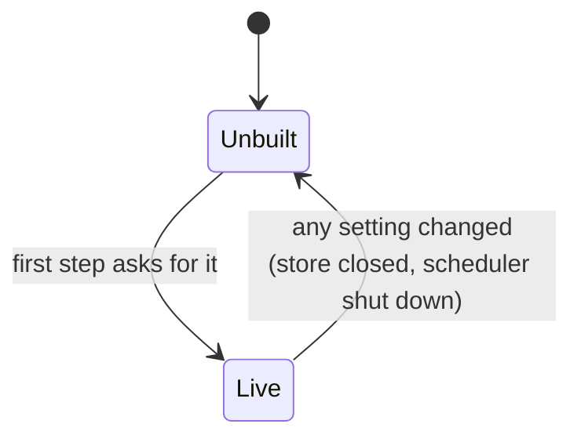
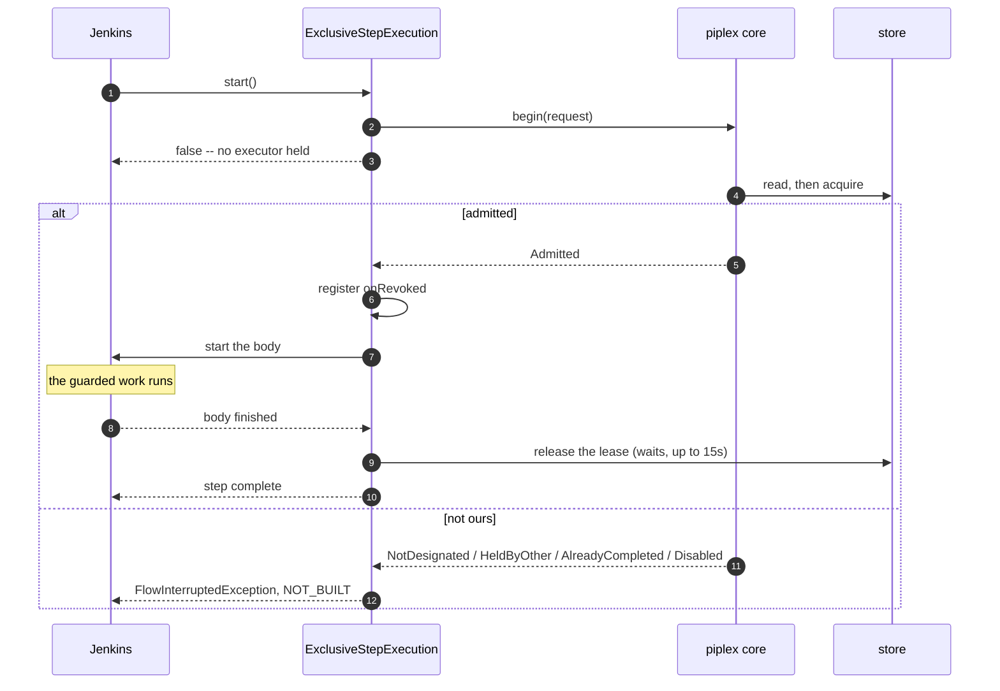
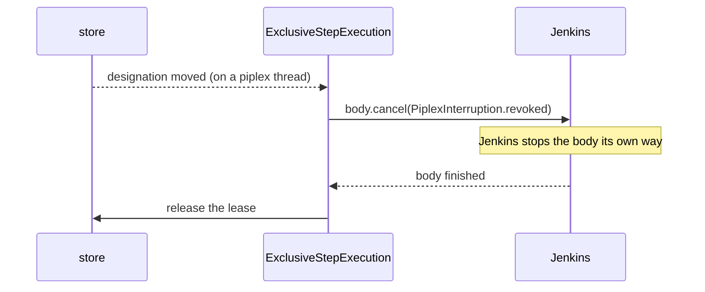
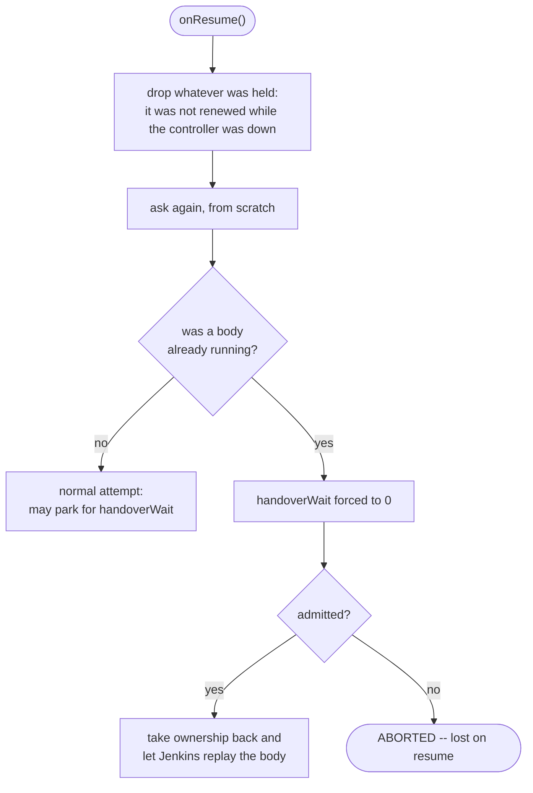

## 5. The Jenkins plugin

Three steps and one configuration section. The plugin is an adapter and nothing more: it parses
parameters, calls the core, and turns an answer into a Jenkins outcome.

For a working setup from scratch, see the [Quick start](00-quick-start.md). This page is the reference.

### Configuring a controller

**Manage Jenkins > System > piplex**

| Field | Example | Notes |
|---|---|---|
| `ownerId` | `euc1-blue` | this controller's identity. Required, and typed in by hand on purpose |
| `clientId` | `piplex-euc1` | what it connects to discas as. Defaults to `ownerId` |
| `nodes` | `n1=10.0.0.1:7101, n2=10.0.0.2:7101` | the cluster. Comma- or newline-separated |
| `watchPollPeriod` | *(blank)* | how long a watch waits between polls. Blank means the client's own, one second. See [cost of watching](06-operations.md#cost-of-watching) |
| `token` | *(secret)* | for a cluster running `--client-auth token`. Blank for the other modes |
| `tls` | `false` | whether to connect over TLS. Nothing below takes effect without it |
| `tlsTruststore` | `/etc/discas/tls/client-ca.p12` | the CA the nodes are checked against. Blank means the JVM's own |
| `tlsTruststorePassword` | *(secret)* | usually blank |
| `tlsKeystore` | `/etc/discas/tls/euc1-blue.p12` | this controller's own certificate. Required under `--client-auth mtls` |
| `tlsKeystorePassword` | *(secret)* | opens the key store, and the key inside it |

The three modes and what to fill in for each are in
[discas, ACLs and TLS](07-discas.md#connecting-jenkins-to-it).

The section is a `GlobalConfiguration` carrying `@Symbol("piplex")`, so Configuration as Code addresses
it the way it addresses any other:

```yaml
unclassified:
  piplex:
    ownerId: "euc1-blue"
    clientId: "piplex-euc1"
    nodes: "n1=10.0.0.1:7101, n2=10.0.0.2:7101, n3=10.0.0.3:7101"
    watchPollPeriod: "30s"
    tls: true
    tlsTruststore: "/etc/discas/tls/client-ca.p12"
    tlsKeystore: "/etc/discas/tls/euc1-blue.p12"
    tlsKeystorePassword: "${PIPLEX_KEYSTORE_PASSWORD}"
```

That is the standard shape for this kind of extension rather than something the plugin does specially.
But **nothing in the test suite covers it** -- the tests configure the section directly. Try it on one
controller before rolling it out.

There is no `doCheck` validation on these fields yet, so a typo in `nodes` surfaces as a failed build
rather than a red field. See [operations](06-operations.md#a-typo-in-nodes).

The two passwords and the token are Jenkins `Secret` values: encrypted at rest, never rendered back
into the form, and resolvable from a CasC variable rather than written into the YAML.

#### Changing a setting closes the store

The store is built on first use and kept:



That has a cost worth stating plainly, because it is not the obvious behaviour. **A run in flight is
holding that store.** Its renewals stop, and it is revoked once its grace period is out, exactly as if
the cluster had gone away.

It is still the right way round. The alternative is a live connection under an identity the operator has
just changed, left open because something might still be using it -- one more of them after every edit,
none of them ever closed.

### `piplexExclusive`

A **block** step. That one decision buys both shapes it needs:

```groovy
// the whole build -- what a nightly job wants
options { piplexExclusive(key: 'eod', designatedBy: 'eod', generation: env.BUSINESS_DATE) }

// one stage
piplexExclusive(key: 'eod') { sh './eod.sh' }
```

This is how `timeout` and `retry` work, and it is the only shape that can **stop** anything. A gate in
the first stage has nothing left to interrupt once it has let the build through.

| Parameter | Default | |
|---|---|---|
| `key` | required | what is being competed for |
| `designatedBy` | unset | the key naming the owner; unset elects instead |
| `generation` | unset | usually `env.BUSINESS_DATE` |
| `completedWhen` | unset | the milestone that means there is nothing to do |
| `enabledBy` | unset | the switch to consult and be stopped by |
| `lease` | `60s` | the handover bound, not the work's duration |
| `renewEvery` | `lease / 3` | |
| `renewalGrace` | `lease` | |
| `handoverWait` | `0` | how long to park rather than end the build |

Durations accept `30s`, `90m`, `4h`, `7d` or ISO-8601 `PT1H30M`.

`ownerId` and `runId` are not parameters. The first comes from the controller's configuration. The
second is the build's own full display name, which is what a reader of two logs needs to tell them
apart, and what makes a second run on this controller lose the lease rather than share it.

#### What it does to the build



**It never occupies an executor.** `start()` returns `false`, so a controller that is not the one that
has to run parks for four hours without holding a node, an executor or a thread. There is a
`FlowExecution` in memory and nothing else.

That is what makes it reasonable to put the same schedule on every controller and let them sort it out.

Revocation while the body runs:



The listener does one thing: ask Jenkins to cancel. The stopping itself happens where Jenkins does it.

The release is **waited for**, up to 15 seconds. Until the lease is gone, the controller taking over has
to wait for it to lapse, and that wait is the handover. Bounded, because a store that has stopped
answering must not also stop the build from finishing, and an unreleased lease lapses on its own.

#### Build results

Getting this wrong is how a team learns to ignore its own build page. Three controllers a night going
red for doing exactly what they were told is not a signal.

| Situation | Result | Shown on the build |
|---|---|---|
| not designated | `NOT_BUILT` | `piplex: did not run 'eod' because 'euc1-green' is designated to run it` |
| nobody designated yet | `NOT_BUILT` | `... because nobody is designated to run it yet` |
| another run holds it | `NOT_BUILT` | `... because 'euc1-blue/eod #142' is running it` |
| already done | `NOT_BUILT` | `... because it is already done up to 2026-09-12` |
| switched off | `NOT_BUILT` | `... because it is switched off: INC-4821` |
| **revoked mid-run** | `ABORTED` | work started and was stopped |
| **lost on resume** | `ABORTED` | this build built something before the restart |

Each is a `CauseOfInterruption`, stored with the build and shown next to it. A line in the log is gone as
soon as somebody looks at the build a week later.

#### A controller restart

Everything the step keeps across a restart is a string. The live half -- the admission, its renewal
timer, its watches -- cannot be serialised, and is not.



Asking again is correct because asking is idempotent, the same reason the core compares state instead of
counting events.

**The body is the exception, and the one thing that must not be redone.** Jenkins wrote its program state
down and replays it from where it stopped, so a resume that also started a body would run the guarded
work twice on the same controller.

What a resume owes a body already running is the ownership it is running under: retaken at once, or the
body stopped. Never *waited for*. A run parked for a handover while its own work is under way is the very
thing this step exists to prevent.

### `piplexPublish`

```groovy
post { success { piplexPublish key: 'data/euc1', generation: env.BUSINESS_DATE } }
```

In `post { success { } }` and nowhere else. A milestone is a promise that the data is there. Publishing
on the way out regardless of outcome turns every waiting pipeline into a consumer of half-written days.

Returns the generation in force afterwards. Safe to re-run, and re-run automatically after a restart:
publishing is idempotent and monotonic, so whether the write landed before the controller went down does
not have to be known.

### `piplexAwait`

```groovy
stage('Wait for EOD') {
    steps { piplexAwait key: 'data/euc1', generation: env.BUSINESS_DATE, timeout: '90m' }
}
```

| Parameter | Default | |
|---|---|---|
| `key` | required | the milestone |
| `generation` | required | what this build needs |
| `timeout` | `1h` | how long to wait |
| `skipOnTimeout` | `false` | end `NOT_BUILT` instead of failing |

Holds no executor while it waits, and survives a restart by looking again. The one thing a restart
changes is that the timeout starts over.

Running out of time **fails the build** by default, and should: something that was supposed to arrive did
not, and the alternative -- carrying on -- is how a day gets imported half-empty without anybody
noticing.

Set `skipOnTimeout: true` when not running is genuinely the right answer. The build then ends `NOT_BUILT`
with what was actually there recorded on it.

### Branching pipelines

The step guards a **body**, not a task. Where the block sits is exactly what it covers.

In `options { }` one lease covers the whole DAG -- every stage, sequential and parallel:

```groovy
options { piplexExclusive(key: 'daily', designatedBy: 'daily', enabledBy: 'daily',
                          generation: env.BUSINESS_DATE) }
stages {
    stage('Process') {
        parallel {
            stage('Trades')    { steps { sh './trades.sh' } }
            stage('Positions') { steps { sh './positions.sh' } }
        }
    }
    stage('Aggregate') { steps { sh './aggregate.sh' } }
}
```

One controller runs every branch; the others run none of them.

Losing that one lease -- designation moved, switched off, taken, or [renewal
failed](02-exclusive-run.md#ownership-is-held-not-granted) past its grace -- cancels that one body.
Every branch in flight is interrupted, nothing downstream starts, the build ends `ABORTED`:

```
Trades     ───────X
Positions  ───────X   ownership lost
Aggregate         ·   never starts
```

What those branches already did is not undone. Interruption stops work; it does not make
half-finished work harmless.

#### A key per branch

When the branches own different things, guard them separately:

```groovy
parallel(
    trades: {
        piplexExclusive(key: 'processing/trades', designatedBy: 'processing/trades',
                        enabledBy: 'processing/trades') {
            sh './trades.sh'
            piplexPublish key: 'data/trades', generation: env.BUSINESS_DATE
        }
    },
    positions: { /* key: 'processing/positions', and so on */ }
)
```

Now losing `processing/trades` stops the trades branch and nothing else, and its switch is its own.
What a stopped branch does to the rest is Jenkins' `failFast`, not piplex's. A branch designated
elsewhere does not run here at all: it runs in the other controller's copy of the build, which is
how a night's work ends up split across controllers.

**Two `piplexExclusive` blocks with the same key in one build is the mistake to avoid.** The lease
is held by `ownerId/runId`, and the run id is the build itself -- so the second block is recognised
as the same holder and let straight in, and whichever branch finishes first releases the lease out
from under the other. Parallel branches need distinct keys.

#### One milestone per result

Publish what a consumer can actually use on its own, and let it wait for just that:

```groovy
parallel(
    trades:    { piplexAwait key: 'data/trades',    generation: env.BUSINESS_DATE, timeout: '90m' },
    positions: { piplexAwait key: 'data/positions', generation: env.BUSINESS_DATE, timeout: '90m' }
)
sh './aggregate.sh'
```

Where only the whole day is useful, publish one milestone instead, once every required branch has
succeeded -- which is what `post { success { } }` means.

| The work | The shape |
|---|---|
| one indivisible business operation | one block in `options` |
| branches owning separate resources | a key, a switch and a milestone each |
| a result only useful whole | one milestone, after all required branches |

#### Two more things that bite

`catchError(catchInterruptions: true)` around guarded work swallows the revocation and carries on
without a lease. So does any `try`/`catch` of `FlowInterruptedException`.

Cancelling reaches as far as Jenkins does. A service or background process the shell started
outlives the branch that started it, and the step hands the pipeline no fencing token to stop it
with -- which is why the work has to be idempotent. See
[overlap](06-operations.md#overlap-is-still-possible).

### Putting it together

```groovy
// One Jenkinsfile. The same job, with the same cron, on every controller.
pipeline {
    agent none
    options {
        piplexExclusive(key: 'eod',
                        designatedBy: 'eod',
                        enabledBy: 'eod',
                        generation: env.BUSINESS_DATE,
                        completedWhen: 'data/euc1',
                        lease: '60s',
                        handoverWait: '4h')
    }
    triggers { cron('H 2 * * *') }
    stages {
        stage('EOD') {
            agent { kubernetes { } }
            steps { sh './eod.sh' }
        }
    }
    post {
        success { piplexPublish key: 'data/euc1', generation: env.BUSINESS_DATE }
    }
}
```

```groovy
// A consumer, anywhere.
stage('Wait for EOD data') {
    steps { piplexAwait key: 'data/euc1', generation: env.BUSINESS_DATE, timeout: '90m' }
}
```

`BUSINESS_DATE` is yours to define -- a shared library, a build parameter, an environment variable.
piplex does not set it.

The cron goes on **every** controller and piplex decides, instead of the schedule being commented out of
three controllers' configuration by hand.

### Installing

```
./gradlew :piplex-jenkins:jpi      ->  piplex-jenkins/build/libs/piplex.hpi
```

Deploy the `.hpi` to each controller. It is not distributed through an update centre. The minimum
supported controller is stamped in the manifest as `Jenkins-Version` and is currently **2.516.3**.

The client and the discas nodes must be the **same version** as each other. See
[operations](06-operations.md#version-skew), and [discas, ACLs and TLS](07-discas.md) for the cluster
side.

---

Previous: [4. Switches](04-switches.md) &middot; Next: [6. Operating piplex](06-operations.md)
