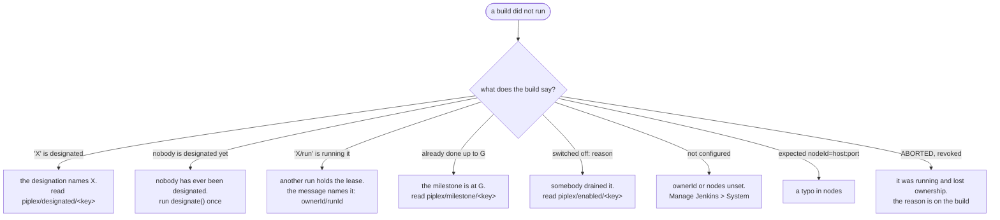

## 6. Operating piplex

What an operator touches, how, and what to look at when something is wrong.

### The keys

Everything piplex knows is in four keys per `<key>`.

| Key | Read it to find out |
|---|---|
| `piplex/designated/<key>` | who is supposed to be running the work |
| `piplex/enabled/<key>` | whether it may run at all |
| `piplex/milestone/<key>` | how far the producer got |
| `piplex/exclusive/<key>` | who holds the lease right now |

The first three are yours. They hold plain JSON and are meant to be read by hand.

**The lease is neither.** It is a lock in the store's own terms -- over discas a binary lock record --
taken, renewed and released by piplex. It does not read as text, and writing to it by hand is how two
controllers end up believing they own the same work.

### Where the procedures run

There is no step and no CLI for the operator side. The three steps are for pipelines; `designate` and
`disable` are the Java API.

From a controller, the Script Console (**Manage Jenkins > Script Console**) reaches them through the
same configuration the steps use:

```groovy
import hudson.model.TaskListener
import io.github.green4j.piplex.jenkins.PiplexConfiguration

def piplex = PiplexConfiguration.get().piplexFor(TaskListener.NULL)
```

`piplex` below is that object.

A small freestyle or pipeline job running the same Groovy is the version with a log and an approval
trail. That is what this should be in anything but an emergency.

### The usual procedures

#### Hand the work to another controller

```groovy
piplex.designations().designate('eod', 'euc1-green', 'ops', 'INC-4821').toCompletableFuture().join()
```

What happens, in order:

1. the current holder is revoked (`DESIGNATION_CHANGED`);
2. it stops its work and releases its lease;
3. a candidate parked on `euc1-green` wakes, sees its own name, and takes over.

If nobody is parked on `euc1-green`, the next scheduled run there picks it up.

Designating the owner who is already named changes nothing and writes nothing.

**Whether a run is taken over or just stopped depends on `handoverWait`.** With it unset, a controller
that is not designated ends its build immediately and the work waits for the next cron.

#### Take the work out entirely

```groovy
piplex.switches().disable('eod', 'INC-4821').toCompletableFuture().join()
...
piplex.switches().enable('eod').toCompletableFuture().join()
```

Runs in flight stop (`DISABLED`). Everybody who looks afterwards gives up. **Nobody takes over** -- that
is the difference between a drain and a handover.

The reason is printed in the log of every build it stops, so write what somebody finding a red build at
03:00 needs.

#### Take one controller out

```groovy
piplex.switches().disable('eod/euc1-blue', 'draining for patching').toCompletableFuture().join()
```

**This only does anything if the pipeline consults that key**, and today a pipeline cannot consult two
switches: `piplexExclusive` takes one `enabledBy`.

The workable form is a job whose `enabledBy` already carries the controller's id, which needs the
administrator to expose it as an environment variable. See
[switches](04-switches.md#draining-one-controller).

Writing the key is the easy half. Being read is the half to check first.

#### Make a consumer stop waiting

There is nothing to cancel. Publish the milestone it is waiting for, or let its timeout run out. A
waiter holds no state anywhere, so nothing is left behind either way.

Publishing a milestone by hand to unblock consumers is a decision to say the data is there. It is the
same statement the producer makes, and it is believed the same way.

### Diagnosing



Every one of these is answerable from the build page plus one key. That is the point of putting the
reason in a `CauseOfInterruption` rather than only in the log.

#### Reading the timeline across controllers

Each controller writes its own decisions into the build log of the run they are about:

```
piplex: ADMITTED key=eod generation=2026-09-12 owner=euc1-blue run="eod #142" fencingToken=8
piplex: REVOKED key=eod generation=2026-09-12 owner=euc1-blue run="eod #142" reason=DESIGNATION_CHANGED newOwner=euc1-green
piplex: NOT_DESIGNATED key=eod generation=2026-09-12 owner=apac1 run="eod #37" currentOwner=euc1-blue
```

The shape is one event name, then `key=value` fields. A value with a space in it is quoted, and `run`
always is, because it is the build's full display name. A field with nothing in it is left out rather
than written as `null`, since an aggregator can filter on a field that is not there.

**Correlate by `key` plus `generation`** and four build logs reconstruct one night. That is what the
fixed event vocabulary in `PiplexObserver` is for. There is no separate event log to collect, and there
is deliberately no history in the store.

### Things that bite

#### A typo in `nodes`

There is no form validation yet, so a malformed entry does not light up the field. It surfaces as a
failed build the first time a step needs the store:

```
piplex: expected nodeId=host:port, got '10.0.0.2:7101'
```

When a build fails this way on a controller that has never worked, look at **Manage Jenkins > System**
first, not at the cluster.

IPv6 literals cannot be expressed: the parser splits on `=` and `:` and requires exactly three parts.

#### Version skew

The client and the discas nodes have to be the **same version**.

`CLIENT_HELLO` changed shape in discas 0.0.2 without the protocol version changing with it. So a 0.0.2
client and a 0.0.1 node do not fail with anything that names a version -- they fail at the handshake,
with a decoding error.

Upgrade clients and nodes together. Suspect this first when a controller that used to connect stops
connecting after a plugin upgrade.

discas **0.0.2 is the floor** for piplex, and that is a hard requirement rather than a preference.

#### Identities in `AllowAll` mode

In discas' default `AllowAll` mode a client id is merely *claimed*, not checked. Any record of who did
what is worth no more than the claim until TOKEN or mTLS is switched on.

Give every controller its own `clientId`, and turn authentication on before treating the store as
evidence of anything. How to do that -- TOKEN, mTLS and ACLs on the cluster, and the matching settings
on each controller -- is [discas, ACLs and TLS](07-discas.md).

#### Changing settings stops runs

Editing `ownerId`, `clientId` or `nodes` closes the store, and a run in flight is revoked once its grace
period is out.

Change them when nothing is running, or accept the revocation. It is the same one a cluster outage
produces. See [the plugin](05-jenkins.md#changing-a-setting-closes-the-store).

#### The lease is not the work's duration

Setting `lease: '4h'` because "the job takes four hours" is the commonest way to make handover slow.

The lease bounds how long a takeover waits when a holder dies without releasing it. The run renews it
automatically for as long as it lasts. Leave it at 60s unless the store is unusually slow.

#### Overlap is still possible

piplex guarantees at most one controller *considers itself* the owner. Between a lease expiring and its
former holder noticing, both may believe it.

If the protected resource does not reject a stale `fencingToken` -- and most do not -- then stopping a
run half way is not the same as making half-finished work harmless. Make the work idempotent, or make
the resource fence. See [the model](01-model.md#what-piplex-guarantees-and-what-it-does-not).

### Cost of watching

A watch in discas is a **poll, not a subscription**, and at `LINEARIZABLE` every poll of every watch is
a consensus round. There are more watches than there look:

| Who | Watches |
|---|---|
| a parked candidate | up to 3 at once, per round -- one per key the request named |
| an admitted run | up to 2 (designation, switch), for as long as it runs |

Left at the discas client's default of one second, a controller parked for four hours on
`handoverWait` spends roughly 14,000 consensus rounds per key asking a question whose answer changes
about once a quarter.

**Set a watch poll period** in **Manage Jenkins > System > piplex** to match how often the answer
actually moves:

| Work | A sensible period |
|---|---|
| a nightly job | `30s` -- `2m` |
| something switched on and off during the day | `5s` -- `15s` |
| left blank | the client's own, one second |

The floor is `500ms`; only the discas client's own configuration may go below it, and there is no
field for that. A value that is not a duration, or is under the floor, is refused when the
configuration is read rather than by the first watch hours into a park.

What it buys back has a limit worth knowing. A parked candidate looks again every `renewEvery`
regardless -- `lease / 3`, so 20s by default -- so a period longer than that round removes the polls
inside one round, never the round itself. Going from 1s to 30s is roughly a twentyfold cut; going from
30s to 2m buys almost nothing on top.

**What you give up is notice, not correctness.** A designation that moves is acted on up to one poll
period later, so the period is added to how long a handover takes. On a nightly job that is
irrelevant; on something drained during an incident, keep it short enough that a `disable` still stops
a run promptly.

#### Why watches read `LINEARIZABLE`, and why that is not a setting

`ReadConsistency` is the other half of what a watch costs, and it is fixed on purpose.

A `LINEARIZABLE` read goes through consensus and returns what is committed now. A `SERIALIZABLE` read
is answered from one node's own state, which may be behind. Most of piplex would not care: a parked
candidate and a waiting consumer both ignore what the watch returned and **read the key again**, so a
stale watch there costs nothing but a wasted wakeup.

The two watches an **admitted run** holds are different. They act on the value the watch itself
returned -- a designation naming somebody else revokes the run there and then, with no second read. A
stale value there means the run is revoked **late**, and late is exactly the window in which the old
owner and the new one both believe they own the work. That window is the one thing piplex cannot close
on its own, and widening it to save consensus rounds is the wrong trade.

Polling less often lengthens the same window. The difference is that a poll period is a number written
in a field, the same on every controller, while staleness is however far behind the node that answered
happens to be -- unbounded, invisible, and worst exactly when the cluster is unwell. So the cost knob
is the period, and the consistency stays where it is.

---

Previous: [5. The Jenkins plugin](05-jenkins.md) &middot; Next: [7. discas, ACLs and TLS](07-discas.md)
