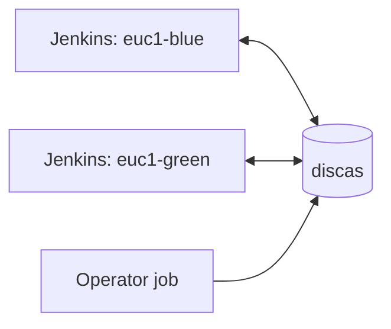

## piplex documentation

Start with the [Quick start](00-quick-start.md). It describes a two-controller estate, generates
everything that estate needs, and exercises a handover, a drain and a cross-controller milestone.

| Page | Use it to |
|---|---|
| [0. Quick start](00-quick-start.md) | Install and run the first coordinated job |
| [1. Model](01-model.md) | Understand state, identity, time and guarantees |
| [2. Exclusive runs](02-exclusive-run.md) | Configure election, designation and handover |
| [3. Milestones](03-milestones.md) | Publish and await completed generations |
| [4. Switches](04-switches.md) | Disable all work or drain one owner |
| [5. Jenkins](05-jenkins.md) | Configure the plugin, and use its work and operator steps |
| [6. Operations](06-operations.md) | Run handovers, diagnose failures and size watches |
| [7. discas and security](07-discas.md) | Configure the cluster, TLS, ACLs and environments |
| [8. Lifecycle](08-lifecycle.md) | Upgrade, roll back and recover |
| [9. Deployment](09-deployment.md) | Stand it up in order, and generate what it needs |

### Architecture

Each controller has its own stable `ownerId` and talks to the same coordination store. Controllers do
not call one another.



`piplex-core` defines the primitives and `CoordinationStore`; `piplex-discas` implements that
interface; `piplex-jenkins` adapts the primitives to the steps a pipeline uses --
`piplexExclusive`, `piplexPublish`, `piplexAwait`, `piplexToken` -- and to the steps an operator
uses: `withPiplexOperator`, `piplexDesignate`, `piplexSwitch` and `piplexInspect`.

`piplex-init` takes one description of an estate and writes the four things that have to name the
same keys: the cluster ACL, each controller's configuration, the five operator jobs built from the
second set of steps, and the block each guarded pipeline needs. It composes every key with the same
code the plugin writes it with, which is the whole reason it exists -- see
[Deployment](09-deployment.md).

Everything it writes is run as it writes it: the generated jobs and the generated pipeline block as
[tests](../piplex-jenkins/src/test/java/io/github/green4j/piplex/jenkins/OperatorJobsTest.java), and
the generated jobs against a real discas node enforcing the generated ACL as
[integration tests](../piplex-jenkins/src/intTest/java/io/github/green4j/piplex/jenkins/PiplexDiscasIntegrationTest.java)
(`./gradlew :piplex-jenkins:intTest`, Docker needed). A runbook is only a runbook while it still
works, and a grant is only a grant where something enforces it.

Whether the generated ACL is the one a person meant is the separate question, and
[three hand-written files](../piplex-init/src/test/resources/acl/) answer it: the generator has to
reproduce them grant for grant.

### Runnable examples

Run an example from the repository with:

```text
./gradlew :piplex-example:run -PmainClass=ElectedRunExample
```

| Main class | Demonstrates |
|---|---|
| `ElectedRunExample` | Lease election |
| `DesignatedHandoverExample` | Designation and takeover |
| `DrainSwitchExample` | Shared and per-owner switches |
| `MilestoneExample` | Monotonic publish and level-triggered wait |
| `DiscasStoreExample` | A real discas-backed store |

The modules are not published to Maven and carry no API-stability promise. The `.hpi` carries
`piplex-core`, `piplex-discas` and `piplex-jenkins`; the examples are built and run from the
repository only.
