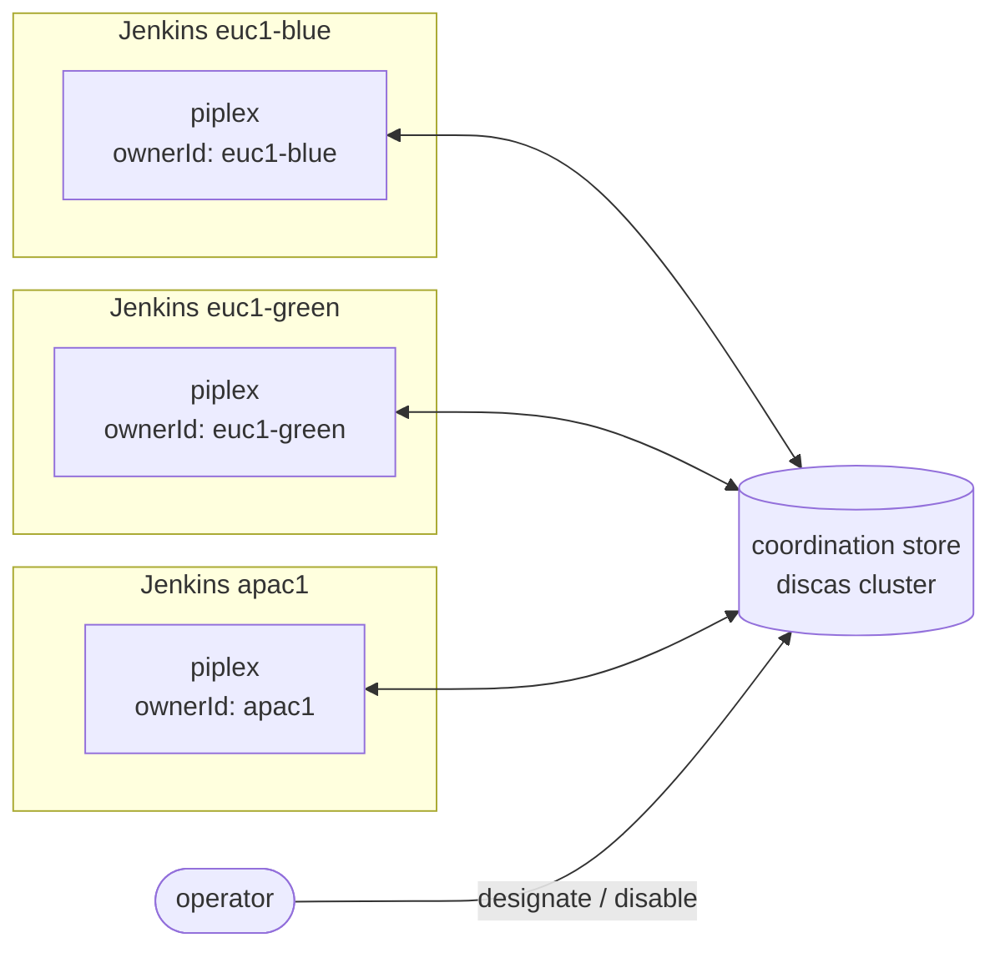
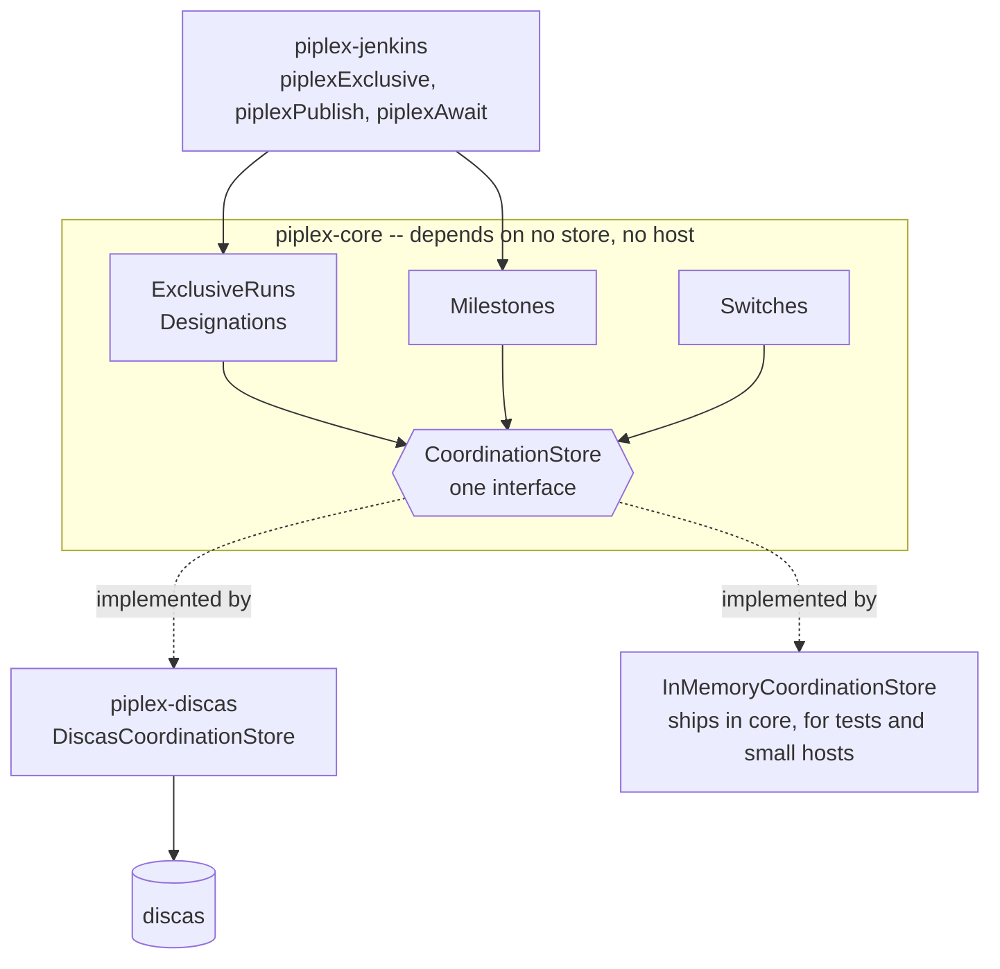

## piplex documentation

The [README](../README.md) says what piplex is and why it exists. These pages say how it works.

**New here? Start with the [Quick start](00-quick-start.md).** It sets up two controllers running one
nightly job, end to end, in about twenty minutes. The other pages explain what you just built.

| Page | Read it to |
|---|---|
| [0. Quick start](00-quick-start.md) | get a working two-controller setup, step by step |
| [1. The model](01-model.md) | understand the store underneath, the four keys, and why everything compares state |
| [2. Exclusive run](02-exclusive-run.md) | know who is allowed to run the work, and how a handover happens |
| [3. Milestones](03-milestones.md) | publish how far a producer got, and wait for it |
| [4. Switches](04-switches.md) | turn work off everywhere in a second |
| [5. The Jenkins plugin](05-jenkins.md) | learn the three steps in full, where to put them in a branching pipeline, and what a restart does to them |
| [6. Operating piplex](06-operations.md) | run the usual procedures, and diagnose what went wrong |
| [7. discas, ACLs and TLS](07-discas.md) | stand up the cluster, and decide how much security it needs |

### The shape of the thing

Several controllers run the same pipeline. Each has its own piplex. They agree through one store:

Nothing flows between the controllers. They never learn of each other except through what the store
says. That is why adding a fourth one is a configuration change and not a topology change.

### What lives where

Implementations are constructed explicitly and passed in. There is no `ServiceLoader`, and nothing is
discovered at runtime. Swapping the store is a diff somebody can read.

`piplex-core` carries one store of its own, the in-memory one, and depends on no host or cluster. The
build enforces that rather than trusting it: `checkCoreIsHostAgnostic` fails if anything outside
`io.github.green4j` reaches the core's runtime classpath.
