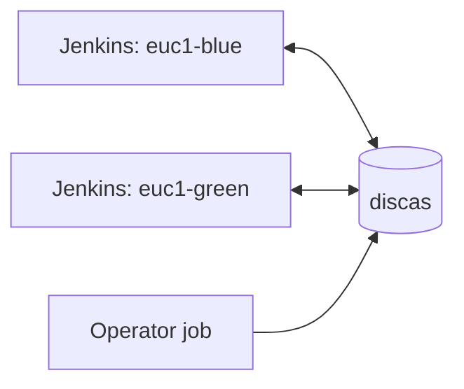

## piplex documentation

Start with the [Quick start](00-quick-start.md). It builds a two-controller setup and exercises a
handover, a drain and a cross-controller milestone.

| Page | Use it to |
|---|---|
| [0. Quick start](00-quick-start.md) | Install and run the first coordinated job |
| [1. Model](01-model.md) | Understand state, identity, time and guarantees |
| [2. Exclusive runs](02-exclusive-run.md) | Configure election, designation and handover |
| [3. Milestones](03-milestones.md) | Publish and await completed generations |
| [4. Switches](04-switches.md) | Disable all work or drain one owner |
| [5. Jenkins](05-jenkins.md) | Configure the plugin and use its four Pipeline steps |
| [6. Operations](06-operations.md) | Run handovers, diagnose failures and size watches |
| [7. discas and security](07-discas.md) | Configure the cluster, TLS, ACLs and environments |
| [8. Lifecycle](08-lifecycle.md) | Upgrade, roll back and recover |

### Architecture

Each controller has its own stable `ownerId` and talks to the same coordination store. Controllers do
not call one another.



`piplex-core` defines the primitives and `CoordinationStore`; `piplex-discas` implements that
interface; `piplex-jenkins` adapts the primitives to `piplexExclusive`, `piplexPublish`,
`piplexAwait` and `piplexToken`.

### Runnable examples

Run an example from the repository with:

```text
./gradlew :piplex-example:run -PmainClass=ElectedRunExample
```

| Main class | Demonstrates |
|---|---|
| `ElectedRunExample` | Lease election |
| `DesignatedHandoverExample` | Designation and takeover |
| `DrainSwitchExample` | Shared and per-owner switches |
| `MilestoneExample` | Monotonic publish and level-triggered wait |
| `DiscasStoreExample` | A real discas-backed store |

The modules are not published to Maven and carry no API-stability promise. They ship together in the
Jenkins `.hpi`.
